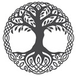

# yggdrasil

Create your real-life personal skills tree showcasing your professional qualifications

Planned features:
 * Browse qualification tracks and view details
 * Create your own profile based on qualifications you have or want to have
 * Browse other user's profiles to view their qualifications
 * See trending qualifications
 * Get personal recommendations

Database:
 * Store tracks, qualifications, dependencies
 * Store users and their tracks and qualifications

Application:
 * User profile page
 * Allow editing of your own profile
 * Qualification pages showing who has earned it
 * Track pages showing the overall qualification track

Tech stack:
 * React web app
 * PostgreSQL database